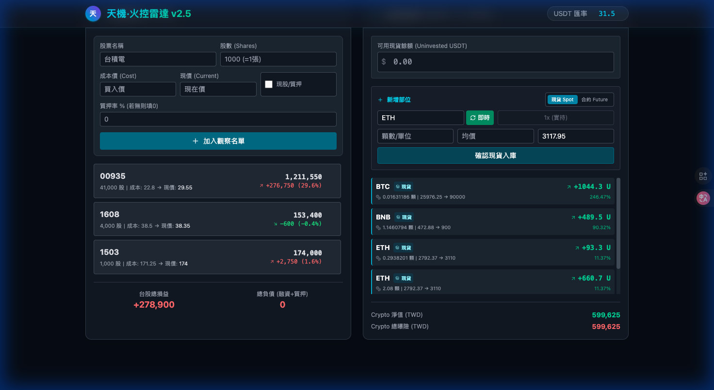
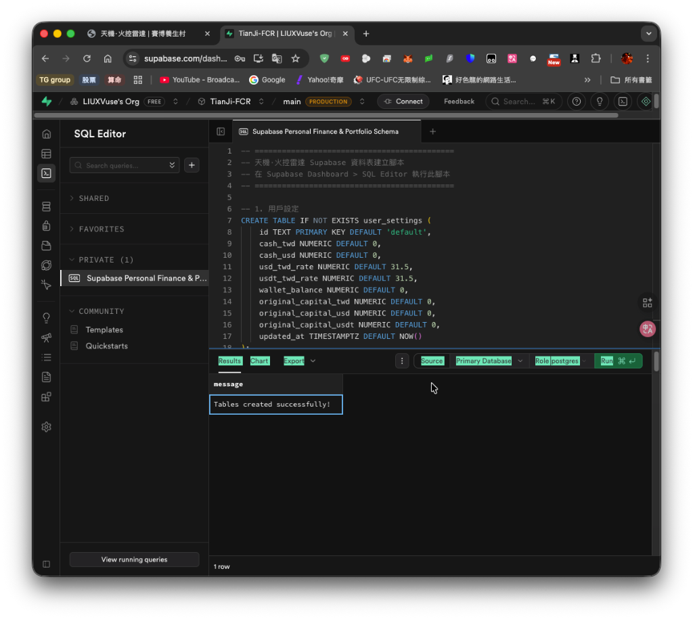

# 天機·火控雷達 (TianJi FCR) v3.0

> **「萬般帶不走，唯有業隨身。但如果你有槓桿，業障會來得特別快。」** —— 天機 AI 財務軍師

一個結合命理智慧與現代金融風控的財務監控系統，支援台股、美股與加密貨幣。內建 AI 財務軍師，可根據八字格局與持倉數據給出客製化建議。

## 📸 功能預覽

- **四大資產模組**：台股、美股、加密貨幣、負債管理
- **即時槓桿監控**：總體/台股/幣圈三元槓桿計算
- **槓桿計算明細**：展開顯示完整公式分解
- **台股即時報價**：串接證交所 API
- **幣安即時價格**：一鍵更新所有加密貨幣現價
- **AI 財務軍師**：結合八字命理的專業財務建議
- **八字自動計算**：輸入生辰自動算出四柱八字
- **Supabase 雲端同步**：支援跨裝置資料漫遊（含設定、持倉、負債、快照與目標）
- **歷史淨值追蹤**：自動/手動快照淨值，並繪製趨勢圖與設定財務目標
- **量化回測系統**：整合台股量化分析工具，支援 12 種策略回測 🆕

## 📸 介面截圖


*主控台：即時資產監控與槓桿分析*


*雲端同步：Supabase 整合，支援跨裝置還原*


*AI 軍師：結合八字與財務數據的即時建議*

---

## 🚀 本地部署教學

### 系統需求

- **Node.js** 18.0+ (建議使用 LTS 版本)
- **npm** 或 **yarn**
- **DeepSeek API Key** (AI 功能需要)

### 步驟 1：下載專案

```bash
git clone https://github.com/LIUXVuse/TianJi-FCR.git
cd TianJi-FCR
```

### 步驟 2：安裝依賴

```bash
npm install
```

> **⚡ 自動化**：`npm install` 會自動執行 `postinstall` 腳本，建立 Python 虛擬環境並安裝量化系統依賴。

#### 如果自動安裝失敗

若看到「⚠️ 量化系統安裝失敗」訊息，請手動執行：

```bash
# 方法一：使用 npm 腳本
npm run setup:quant

# 方法二：手動安裝
cd tw-quant-simple
python3 -m venv .venv
source .venv/bin/activate  # Mac/Linux
pip install -r requirements.txt
cd ..
```

> 💡 **系統需求**：量化功能需要 Python 3.8+，請確認已安裝 Python

### 步驟 3：設定 API Key

在專案根目錄創建 `.env.local` 檔案：

```bash
# .env.local
DEEPSEEK_API_KEY=sk-你的DeepSeek-API-Key
```

> 💡 DeepSeek API Key 可在 <https://platform.deepseek.com> 申請

### 步驟 4：啟動開發伺服器

```bash
npm run dev
```

### 步驟 5：開啟瀏覽器

訪問 <http://localhost:3000>

> 💡 整合版會自動啟動量化後端 (port 8000)，點選導航列「🔬 量化」即可使用

---

## 🔮 功能特色

### 1. 真實槓桿計算

| 項目 | 計算公式 |
|-----|---------|
| **總體槓桿** | 總曝險 ÷ 總淨值 |
| **台股槓桿** | 台股市值 ÷ 台股淨權益 |
| **幣圈槓桿** | 幣圈倉位 ÷ 幣圈淨權益 |

點擊「槓桿計算明細」可展開查看完整公式分解。

### 2. 台股模組 (TWD)

- ✅ 現價/成本價輸入，自動計算盈虧
- ✅ **融資模式**：2.5 倍槓桿 (自備4成/借6成)
- ✅ **質押模式**：自訂質押成數
- ✅ **證交所即時報價**：盤中即時價，盤後收盤價
- ✅ **一鍵更新**：批次更新所有持股現價

### 3. 美股模組 (USD)

- ✅ 支援美股部位管理
- ✅ 自動匯率換算 (USD → TWD)
- ✅ 損益追蹤
- ✅ **Margin 槓桿**：支援輸入借款金額 🆕
- ✅ **美金現金部位**：獨立管理 🆕
- ✅ **Yahoo Finance 即時報價**
- ✅ **一鍵更新價格**

### 4. 加密貨幣模組 (USDT)

- ✅ **現貨 (Spot)**：無槓桿持倉
- ✅ **合約 (Future)**：支援槓桿
- ✅ **幣安即時價格**：自動取得幣價
- ✅ **一鍵更新**：批次更新所有持倉現價
- ✅ 自動匯率換算 (USDT → TWD)

### 5. 負債管理 🆕

- ✅ 支援信貸、房貸、車貸、其他
- ✅ 自動計算總負債
- ✅ 納入淨值計算

### 6. 匯率服務

- ✅ **USDT/TWD**：MAX 交易所即時匯率
- ✅ **USD/TWD**：ExchangeRate-API 即時匯率 🆕
- ✅ 手動輸入調整
- ✅ 一鍵更新匯率按鈕 🆕

### 7. AI 財務軍師

- ✅ **DeepSeek API**：使用 deepseek-chat 模型
- ✅ **命理人設**：結合八字、紫微斗數
- ✅ **完整數據傳送**：所有持倉明細
- ✅ **問題輸入**：⌘+Enter 送出
- ✅ **自訂人設**：可輸入個人八字資料

### 8. 八字計算

- ✅ **lunar-javascript 庫**：精確計算
- ✅ 輸入西曆生辰，自動算出四柱八字
- ✅ 五行分布統計
- ✅ 節氣、農曆日期

### 9. 本地資料庫

- ✅ **IndexedDB**：穩定可靠
- ✅ 自動從 localStorage 遷移
- ✅ 雙寫策略，不易遺失資料

### 10. 原始本金與獲利追蹤 🆕

- ✅ **原始本金輸入**：台幣、美金、USDT 分開紀錄
- ✅ **真實總獲利計算**：目前淨值 - 原始本金
- ✅ TWD 換算顯示

### 11. 資金運用率 🆕

- ✅ **台股運用率**：市值 / (現金 + 市值)
- ✅ **美股運用率**：市值 / (美金現金 + 市值)
- ✅ **幣圈運用率**：倉位 / (閒置U + 倉位)
- ✅ hover 顯示槓桿 + 運用率

### 12. 歷史紀錄頁面 🆕

- ✅ **淨值走勢圖**：AreaChart + 目標參考線
- ✅ **X 軸縮放**：Brush 拖曳選擇時間區段
- ✅ **目標線視覺化**：背景漸層填充 + 動態 Y 軸
- ✅ **每日快照**：每日最多 5 筆，隔天保留最新一筆
- ✅ **目標追蹤**：設定財務目標，追蹤達成進度
- ✅ **波段分析**：歷史高低點、目前位置百分比
- ✅ **資產配置**：四宮格餅圖（台股/美股/幣圈/負債）
- ✅ **設定記憶**：目標線開關、時間區間 localStorage 持久化

### 14. 量化回測系統 🆕

- ✅ **整合 tw-quant-simple**：一鍵啟動前端 + 量化後端
- ✅ **12 種策略**：MA 均線、RSI、MACD、布林通道、外資跟單等
- ✅ **個股回測**：自訂時間範圍、分析績效指標
- ✅ **投資組合回測**：等權重、鑽石手、定期定額策略
- ✅ **全市場掃描**：2600+ 股票夏普比率排名
- ✅ **法人籌碼策略**：外資/投信連續買超訊號

### 13. localStorage 儲存 Keys 🆕

| Key | 用途 | 格式 |
|-----|------|------|
| `tianji_history_v1` | 快照、目標資料 | JSON |
| `tianji_goalLines` | 目標線開關狀態 | JSON `{goalId: boolean}` |
| `tianji_timeRange` | 時間區間設定 | `'7d' \| '1m' \| '3m' \| '1y' \| 'all'` |

---

## 📁 專案結構

```text
tianji-fcr/
├── App.tsx                # 主應用程式
├── types.ts               # TypeScript 類型定義
├── components/
│   ├── StockSection.tsx     # 台股模組
│   ├── USStockSection.tsx   # 美股模組 🆕
│   ├── CryptoSection.tsx    # 加密貨幣模組
│   ├── DebtSection.tsx      # 負債模組 🆕
│   ├── CalculationBreakdown.tsx # 計算明細
│   ├── HistoryPage.tsx      # 歷史紀錄頁面 🆕
│   └── TianJiCard.tsx       # 通用卡片元件
├── services/
│   ├── deepseekService.ts   # AI 財務建議
│   ├── baziService.ts       # 八字計算
│   ├── dbService.ts         # IndexedDB 服務
│   ├── historyService.ts    # 歷史快照與目標 🆕
│   ├── twseService.ts       # 證交所報價
│   ├── binanceService.ts    # 幣安價格
│   ├── exchangeRateService.ts # USD/TWD 匯率 🆕
│   └── maxService.ts        # MAX 匯率
├── vite.config.ts         # Vite 設定 (含 API proxy)
├── API_SPEC.md            # API 規格文件
├── .env.local             # 環境變數 (需自行建立)
└── tw-quant-simple/       # 量化回測系統 (子專案) 🆕
    ├── web/app.py           # FastAPI 後端
    ├── backtest/            # 回測引擎與策略
    └── data/                # 股價與法人資料
```

---

## ❤️ 支持開發 (Sponsor)

如果您喜歡此作品，覺得它幫助您避開了爆倉風險，或是在交易中獲得了平靜，可以考慮透過以下方式支持持續開發：

| 平台 | 帳號 |
|------|------|
| **USDT (TRC20)** | `TExxw25EaPKZdKr9uPJT8MLV2zHrQBbhQg` |
| **X Payments** | `liupony2000.x` |

您的支持將用於伺服器維護與 AI token 消耗，非常感謝！🙏

---

## 🛠️ 開發與設定

### 12. **歷史紀錄頁面**

    - 點擊 Tab 切換至「歷史紀錄」頁面
    - 查看淨值趨勢圖與資產分佈
    - 設定財務目標（Goal Line）
    - 管理每日快照（系統每日自動保留一筆，可手動快照）

### 13. **雲端同步 (Supabase)**

    - **上傳 (☁️↑)**：將本地端所有資料上傳至雲端資料庫
      - 包含：全域設定、未實現損益、台美股持倉、幣圈合約/現貨、負債、歷史快照、財務目標
    - **下載 (☁️↓)**：從雲端下載資料覆蓋本地端
      - 適用情境：更換瀏覽器、跨裝置使用、或資料救援
    - **狀態指示**：
      - 灰色：閒置
      - 綠色：同步成功
      - 紅色：同步失敗 (請檢查 Console 或環境變數)

---

## ☁️ Supabase 雲端同步設定 (Setup Guide)

若要啟用雲端同步功能，請依照以下步驟設定您的個人 Supabase資料庫（免費）：

### 步驟 1：建立 Supabase 專案

1. 前往 [Supabase 官網](https://supabase.com/) 並註冊/登入。
2. 點擊 **"New Project"** 建立一個新專案。
3. 記下專案的密碼 (Database Password)。

### 步驟 2：取得 API Key 與 URL

1. 專案建立完成後，進入 Project Dashboard。
2. 前往 **Project Settings** (左下角齒輪圖示) > **API**。
3. 找到 **Project URL** 與 **anon / public Key**。

### 步驟 3：設定環境變數

1. 在專案根目錄建立 `.env.local` 檔案（如果不存的話）。
2. 填入以下內容，並替換為步驟 2 取得的數值：

```bash
VITE_SUPABASE_URL=https://你的專案ID.supabase.co
VITE_SUPABASE_ANON_KEY=你的_anon_key
```

### 步驟 4：初始化資料庫

1. 在 Supabase Dashboard 左側選單點擊 **SQL Editor**。
2. 點擊 **New Query**。
3. 複製本專案中的 `supabase_setup.sql` 檔案內容，貼上並執行 (Run)。
    > 檔案位置：`/supabase_setup.sql`
4. 若看到 "Success" 訊息，代表資料表建立完成。

### 步驟 5：重啟應用程式

1. 在終端機執行 `npm run dev` 重啟服務。
2. 介面右上角出現雲端圖示即代表功能啟用。

---

## 🔧 API 服務

| 服務 | 來源 | 費用 | 說明 |
|-----|------|-----|------|
| **台股報價** | 證交所 (TWSE) | 免費 | 盤中即時/盤後收盤 |
| **幣價** | 幣安 (Binance) | 免費 | USDT 交易對 |
| **匯率** | MAX 交易所 | 免費 | USDT/TWD |
| **AI** | DeepSeek | 付費 | 需申請 API Key |
| **八字** | lunar-javascript | 免費 | 本地計算 |

---

## ⚠️ 注意事項

1. **DeepSeek API Key 必填**：AI 功能需要設定 API Key
2. **CORS 已處理**：透過 Vite proxy 解決跨域問題
3. **僅供參考**：本系統建議僅供參考，投資請自行判斷
4. **數據安全**：所有數據儲存在本地，不會上傳

---

## 🧙‍♂️ AI 預設人設

```text
你是一位精通《子平八字》、《紫微斗數》、《六壬神課》，
且深諳現代科技與商業戰略的 30 年經驗命理大師（自稱「老夫」）。

風格：半文半白、語氣狂妄但邏輯嚴密、一針見血。
任務：擔任用戶的軍師，協助財務規劃。
```

可在 AI 設定中自訂人設（點擊齒輪按鈕）。

---

## 📝 更新日誌

### v3.1 (2025-12) 🆕

- ✨ 整合量化回測系統 (tw-quant-simple)
- ✨ 新增「量化」標籤頁，一鍵切換
- ✨ 一個 `npm run dev` 同時啟動前端 + 量化後端
- ✨ 支援 12 種交易策略回測
- ✨ 投組回測：等權重、鑽石手、定期定額
- 🔧 更新 Vite proxy 設定，整合量化 API

### v3.0 (2025-12)

- ✨ 新增美股模組 (USD)
- ✨ 新增負債管理 (信貸/房貸/車貸)
- ✨ 新增槓桿計算明細展開區
- ✨ 新增八字自動計算 (lunar-javascript)
- ✨ 新增 IndexedDB 本地資料庫
- ✨ 新增資料自動遷移功能
- 🔧 優化 AI 提示詞架構
- 🔧 修復資料遺失問題

### v2.5 (2025-12)

- ✨ 新增 DeepSeek AI 財務軍師
- ✨ 新增台股即時報價 (證交所 API)
- ✨ 新增幣安即時價格 API
- ✨ 新增 MAX 交易所匯率 API
- ✨ 新增 AI 人設自訂功能
- 🔧 修復 CORS 跨域問題

---

*Powered by LIU PIN HSIAO如果您喜歡此作品，可以考慮透過以下方式支持持續開發：USDT (TRC20) TExxw25EaPKZdKr9uPJT8MLV2zHrQBbhQgX Payments liupony2000.x*
